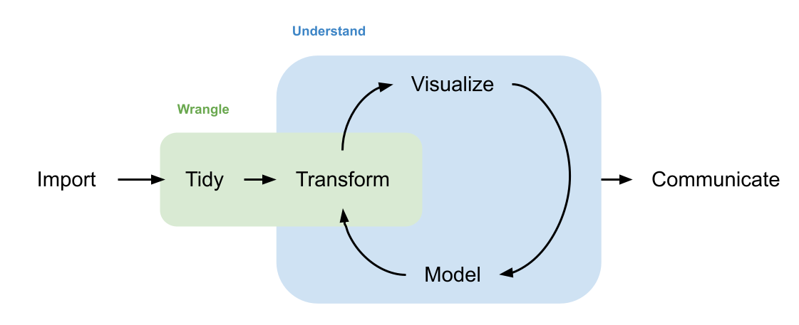

```{r include=FALSE}
knitr::opts_chunk$set(comment=NA, fig.align="center")
```

## Tidyverse
The [Tidyverse](https://www.tidyverse.org/) is a collection of R packages that are designed to work well together. Their fundamental assumption is that data is represented in a so-called "tidy" format, which basically means that it fits into a table where a row corresponds to an observation and a column corresponds to a variable (more details are available in [this article](https://www.jstatsoft.org/article/view/v059i10)).

Here's how a typical data science workflow looks like:

```{r echo=FALSE, fig.cap="Data science workflow (adapted from [here](https://github.com/hadley/r4ds/blob/master/diagrams/data-science-wrangle.png)).", out.width="75%"}

```

The Tidyverse offers packages that cover all aspects of this workflow. In this course, we will focus on data wrangling (the green box). In addition, we will also briefly discuss importing and visualizing data.

## Prerequisites
To get started with the Tidyverse, we need to install both [R](https://cloud.r-project.org/) and [RStudio](https://www.rstudio.com/products/rstudio/download/). Although RStudio is technically not required, I strongly recommend it because it makes working with R much more pleasant.

Once you have these programs on your computer, start RStudio and install the `tidyverse` package, which is basically a meta-package consisting of the most important packages from the Tidyverse. We will also need the `nycflights13` and `palmerpenguins` packages, because they contain nice data sets that we will explore.

We will now go through some basic R commands and workflows. Ideally, you should already be familiar with most of these topics. If not, this hopefully serves as a quick refresher. Note that we show R code in gray boxes and output/results in white boxes throughout the document, for example:

```{r}
mean(c(1, 2, 3))
```

You can copy code from a gray box and paste it into the R console (try it out with the previous example).

This workshop is based on selected chapters from the book "R for Data Science" by Hadley Wickham and Garrett Grolemund. An online version is freely available at https://r4ds.had.co.nz/.

```{r echo=FALSE, fig.cap="R for Data Science.", out.width="20%"}
knitr::include_graphics("https://github.com/hadley/r4ds/blob/master/cover.png?raw=true")
```

## R basics
### Packages
A package contains additional functions that extend the capabilities of R. We install a package with the `install.packages()` function. In this workshop, we are going to use `tidyverse`, `nycflights13`, and `palmerpenguins`. To install them, run the following commands in the R console (note that package names must be surrounded by single or double quotes):

```{r eval=FALSE}
install.packages("tidyverse")
install.packages("nycflights13")
install.packages("palmerpenguins")
```

Alternatively, you can use the "Packages" pane in RStudio (bottom right pane in the default layout) to install/update/uninstall R packages.

Once installed, we need to activate a package with the `library` function in each R session. If we don't activate a package, we do not have direct access to the functions it contains. Here's how we activate the packages that we've just installed:

```{r eval=FALSE}
library(tidyverse)
library(nycflights13)
library(palmerpenguins)
```

Note that we can also use functions contained in a package without activating by prepending the function name with the package name and two colons, for example `nycflights13::flights`.

### Working directory
When R runs commands, it performs all computations in the so-called working directory. R expects all data files that you want to import in this directory (if not otherwise specified). The working directory can be any directory on your computer, and there are several options to change it.

The function `getwd()` returns the current working directory. Alternatively, the subtitle of the "Console" pane in RStudio (bottom left in the default layout) displays the working directory.

The function `setwd()` sets the working directory to the folder passed as an argument, for example `setwd("C:/Users/myuser/R")` or equivalently `setwd("~/R")` (the tilde symbol is short for the current user's home directory). Note that directories need to be separated with a forward slash `/` even on Windows (which normally uses a backslash `\`). Alternative methods to change the working directory with RStudio include the "Session &ndash; Set Working Directory" menu and the "Files" pane (bottom right). Also, if you double-click an R script in Windows Explorer or macOS Finder, RStudio will open it and automatically set the working directory to the corresponding file location.

### R code
Typically, we enter R commands in the console. A prompt symbol `>` indicates that R is ready for our input (note that we do not show the prompt symbol in the gray code boxes). Once we hit the ⏎ (enter or return) key, R will immediately evaluate what we just typed and print the result. This workflow is called [REPL](https://en.wikipedia.org/wiki/Read%E2%80%93eval%E2%80%93print_loop) (read-eval-print loop), and it is a convenient way to interactively work with R and try out new things. Here's an example of some commands with their outputs (try typing the commands into your console):

```{r}
1 + 9  # this is a comment
x <- 1:10  # the value of x is not printed
sum(x)  # function call
```

Notice that when creating a new object with the assignment operator `<-` (read "gets"), R does not automatically print its value. However, often it is useful to first assign a new object and then immediately inspect its value. We could do this with two lines of code:

```{r}
x <- 1:10
x
```

A more convenient way is to enclose the assignment in parentheses, which will both create the object and print its value:

```{r}
(x <- 1:10)
```

The console is nice to try out commands and play around with code (until it runs without errors). However, if we want to save a sequence of R commands for later use, we can put them into so-called R scripts. An R script is a plain-text file (ending in `.R`) containing R commands, usually one command per line. RStudio includes an editor (top left pane in the default layout), which can be used to write, edit, and run (parts of) a script.

In practise, a data analysis project stored as an R script can be run over and over again. This means if another person wants to reproduce your analysis, all you need to do is share your script and data files. The person then runs your entire script, for example by clicking on the "Source" icon, which fully reproduces the entire analysis and all results.

### RStudio keyboard shortcuts
RStudio includes many useful keyboard shortcuts. It really pays off to remember some of them, because your workflow will become faster and more efficient. An overview of all keyboard shortcuts is available in the "Help &ndash; Keyboard Shortcuts Help" menu item.

Here are four important shortcuts that everyone should use:

- The ↑/↓ arrow keys access your command history. You can edit any command you pull up before running it.
- If you are searching for a previously entered command starting with specific characters, enter the characters in the console and press ⌘&nbsp;↑ on macOS or Ctrl&nbsp;↑ on Windows and Linux.
- The shortcut for the assignment operator `<-` is ⌥&nbsp;&ndash; (macOS) or Alt&nbsp;&ndash; (Windows and Linux).
- Hitting ⌘&nbsp;⏎ (macOS) or Ctrl&nbsp;⏎ (Windows and Linux) in the editor runs the command under the cursor in the console.

### Vectors
The most basic (atomic) data type in R is a vector. A vector is a collection of objects which all have the same type. Even a scalar number like `1` is really a vector in R. The `c()` function creates vectors consisting of one or more elements (`c` is short for "concatenate"). The `length()` function returns the number of elements in a vector.

Important data types include numeric vectors, character vectors, logical vectors, factors, and datetime vectors. We can use the `class()` function to determine the type of a given object. Here are some examples:

```{r}
x <- 1
class(x)
length(x)
y <- c(4, 5.6, -7)
class(y)
length(y)
c("Hello", "world!")  # character
c(TRUE, FALSE)  # logical
y > 4  # a comparison creates a logical result vector
factor(c("A", "A", "B", "A", "C", "C", "A", "B"))  # factor with three levels
as.Date(c("17.3.2020", "22.5.2020", "3.3.2021"), format="%d.%m.%Y")  # datetime
```

### Data frames
A data frame is a collection of vectors (with identical lengths). In other words, it represents a table consisting of rows and columns for storing rectangular data.

```{r}
(df <- data.frame(x=1:5, y=c(6, -9.5, 166, 8.8, 0.112), z=c("A", "X", "X", "B", "A")))
```

The Tidyverse package `tibble` provides an improved data frame type called tibble. A tibble is a drop-in replacement for a data frame, so we can use tibbles everywhere data frames are expected.

```{r}
tibble::tibble(x=1:5, y=c(6, -9.5, 166, 8.8, 0.112), z=c("A", "X", "X", "B", "A"))
```

Note how data frames and tibbles print differently in the previous examples. Arguably, tibbles are more readable and include their dimension (`# A tibble: 5 x 3`) as well as column data types (`<int>`, `<dbl>`, and `<chr>`, which is short for integer, double, and character).

RStudio offers a nice integrated data frame viewer; the `View()` function will visualize any data frame or tibble in a spreadsheet-like environment. The data frame from the previous example can be viewed with `View(df)`.

### Functions
Almost everything in R is a function. A function performs some pre-defined computations on (optional) input arguments and (optionally) returns a result. We routinely call functions that have been defined elsewhere, for example the `c()`, `class()`, and `length()` functions. A pair of parentheses `()` after a function name indicates that we are calling that function. We can also define our own functions, but this is an advanced topic outside the scope of this workshop.

Here are some examples for function calls:

```{r}
c(1, 2, 3)  # 3 arguments
class("A")  # 1 argument
length(c(4, 5, 6))  # nested function calls
```

The last example shows two nested function calls. First, we call the `c()` function with three arguments, which we use as an argument in the `length()` function call. R tries to reduce all expressions to a value, so it works its way from the innermost layer to the outermost one. Therefore, a nested function call is really two function calls in the following order:

```{r}
(tmp <- c(4, 5, 6))
length(tmp)
```

### Help
You can view the documentation for any object by prepending a `?` to the object name, for example `?length` shows the help page for the `length` function. You can also press F1 to display help for the object at the current cursor location.
